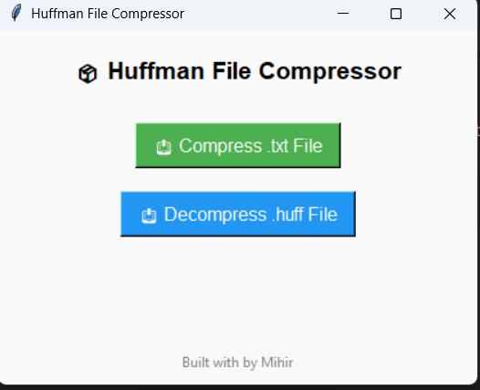

# 📦 Huffman File Compressor (with GUI)

A user-friendly desktop application that compresses and decompresses `.txt` files using the **Huffman Coding** algorithm. Built with **Python** and **Tkinter**, this tool allows users to efficiently reduce file sizes with real-time feedback and a clean interface.

(assets/Screenshot2.png)

---

## 🚀 Features

- 🔁 Compress and decompress `.txt` files using Huffman Coding
- 🖥️ Interactive GUI built with Tkinter
- 📊 Shows original size, compressed size, and compression percentage
- 📁 Custom destination selection for output files

---

## 📂 Folder Structure

```
huffman-compressor/
├── huffman.py              # Huffman encoding/decoding logic
├── main.py                 # Tkinter GUI logic
├── README.md               # Project description     
└── assets/                 # GUI screenshots
   
```

---

## 💻 How to Run

### 1. Clone the Repository

```bash
git clone https://github.com/msp008987/huffman-compressor.git
cd huffman-compressor
```

### 2. Run the Application

```bash
python gui.py
```

You’ll see a GUI window where you can:
- Select a `.txt` file
- Compress it to `.huff`
- Decompress `.huff` files back to `.txt`
- View compression stats instantly!


---

## 📉 Compression Stats Example

Example output shown in the GUI:

```
✅ Compression successful!

📁 Original Size: 683 bytes
📦 Compressed Size: 1014 bytes
📉 Compression: 48.46%
```

---

## 📚 Concepts Used

- Huffman Tree (Greedy Algorithm)
- Binary Encoding & Bit Manipulation
- File I/O (Reading/Writing Bytes)
- Tkinter GUI Development

---

## 🙋 Author

**Mihirkumar Patel**  

---

